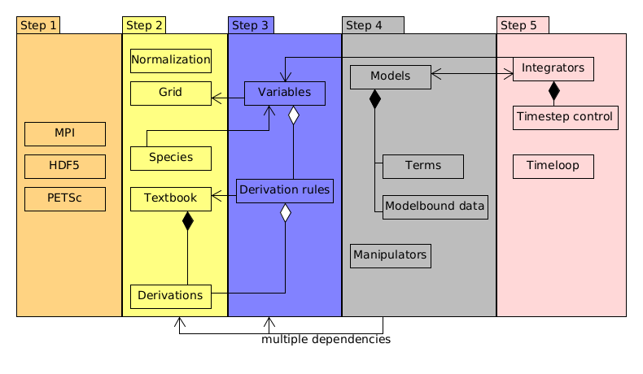

# ReMKiT1D Python support
[](https://github.com/ukaea/ReMKiT1D-Python/actions/workflows/pytest_action.yml)
[](https://github.com/ukaea/ReMKiT1D-Python/actions/workflows/code_quality.yml)
[](https://codecov.io/gh/ukaea/ReMKiT1D-Python)
[](https://remkit1d-python.readthedocs.io/en/latest/?badge=latest)

Contact: stefan.mijin@ukaea.uk

## Overview

RMK_support is a collection of tools designed to configure and analyze ReMKiT1D runs. [ReMKiT1D](https://github.com/ukaea/ReMKiT1D) is a framework for building multi-fluid models in 1D with reaction and kinetic electron support, aimed primarily at simulating the tokamak Scrape-Off Layer. 

ReMKiT1D runs use JSON files to configure the models and methods used by the code, and RMK_support provides convenient Python routines for the generation of these config files, while also providing features that enable analysis of data using obtained from ReMKiT1D runs.

For a high level overview of the framework and the Python interface see the [code paper](https://www.sciencedirect.com/science/article/pii/S0010465524001188).

## Prerequisites 

All routines are written for Python3, with the following libraries required for the .py support modules:

1. numpy
2. xarray
3. holoviews
4. panel 
5. matplotlib
6. h5py
7. scipy

## Installation

RMK_support is installable using pip through PyPI by simply calling

```
pip install RMK_support
```

Alternatively, it can be installed from this repository by running

```
pip install .
```
from the repository root. 

## Repository structure

The package files are in the RMK_support folder, together with the tests, which can be run using pytest.

The examples folder contains both general examples and tutorials for problems relevant in SOL physics, as well as a number of verification tests, some of which have been reported on in the code paper. 

The data folder contains some atomic data used by some of the examples, in particular the spontaneous emission rates for hydrogen obtained from NIST (see the [CRM example](https://github.com/ukaea/ReMKiT1D-Python/blob/master/examples/ReMKiT1D_crm_example.ipynb) notebook). This folder should contain the amjuel.tex file from the EIRENE AMJUEL database in order to run some of the examples! This file is not distributed with the repository.

## High-level workflow

### 1. Initialization

The main group of support modules handle the translation of initialization data into the JSON format in a way that ReMKiT1D's initialization routines can decode. 

While it is possible to write most of the required config.json file by hand if the user knows the exact key names in the corresponding ReMKiT1D initialization routine, a wrapper ecosystem allows users to initialize config files with little to no knowledge of the underlying json structure. 

The general workflow of initializing a functional config.json file using the RKWrapper class can be roughly divided into 5 steps:

1. Setting up global external library options (MPI, PETSc, HDF5)
2. Initializing the basic objects used by the code. These include normalization, the grid, a standard textbook object and optional custom derivations, as well as species data. Most of these have default options that can be used to simplify the initialization procedure.
3. Setting up the variable container by adding variables and optionally initializing them, as well as associating derived variables in the variable container with derivations by supplying a derivation name and a number of required variables used in the calculation. At this stage the interaction between the MPI and HDF5 libraries and the variables can be specified through options to communicate or output specific variables.
4. Defining the models used to evolve/calculate variables by specifying term options and modelbound data. This is the main part of the configuration file and the most complex. See different notebooks for examples of how to initialize models. Optional data manipulator objects can be specified here as well.
5. The last step is specifying time integration options. Here the integrator structure and timestep control can be specified, as well as the structure of the main timeloop (timestep number, output frequency etc.)

The above steps are shown in the figure below, with some of the interdependencies shown in UML style. 



### 2. Data analysis and visualization 

The secondary feature of RMK_support modules is data analysis and visualization, powered by variable data being stored in an xarray dataset and visualization tools built on holoviews and panel. Examples of loading simulation data and using holoviews/panel for visualization are in multiple notebooks. 

Further development is planned to streamline data analysis, including improvements to the included interactive dashboard. 

## Documentation, examples and tutorials

For a high level explanation of both the framework and the interface the user is referred to the ReMKiT1D code paper, where the code design is explained and an example workflow with this Python package is explained. 

The examples/tutorials in the examples folder supplement the code paper, in particular the [advection](https://github.com/ukaea/ReMKiT1D-Python/blob/master/examples/ReMKiT1D_advection_test.ipynb) and [custom fluid](https://github.com/ukaea/ReMKiT1D-Python/blob/master/examples/ReMKiT1D_custom_fluid.ipynb) notebooks, which are documented in detail. Note that these are now using many outdated features.

For the list of the newest example notebooks, where new features are covered, see the CHANGELOG.

Further code documentation is available [here](https://readthedocs.org/projects/remkit1d-python/), where links to newer resources can be found.

## Licence

RMK_support is free software: you can redistribute it and/or modify it under the terms of the GNU General Public License as published by the Free Software Foundation, either version 3 of the License, or (at your option) any later version.

RMK_support is distributed in the hope that it will be useful, but WITHOUT ANY WARRANTY; without even the implied warranty of MERCHANTABILITY or FITNESS FOR A PARTICULAR PURPOSE. See the GNU General Public License for more details.

You should have received a copy of the GNU General Public License along with RMK_support. If not, see <https://www.gnu.org/licenses/>. 

Copyright 2023 United Kingdom Atomic Energy Authority