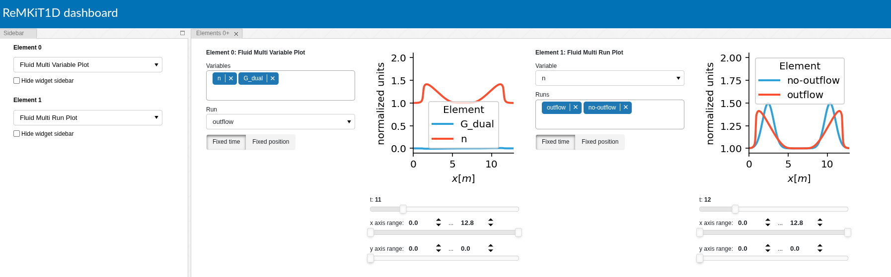

# ReMKiT1D Python support - v2.0.0-beta.1
[](https://github.com/ukaea/ReMKiT1D-Python/actions/workflows/pytest_action.yml)
[](https://github.com/ukaea/ReMKiT1D-Python/actions/workflows/code_quality.yml)
[](https://codecov.io/gh/ukaea/ReMKiT1D-Python)
[](https://remkit1d-python.readthedocs.io/en/latest/?badge=latest)

Contact: stefan.mijin@ukaea.uk

**IMPORTANT**: This is version 1.2.1 of the Python framework. It is the last v1.x release and is tied to v1.2.1 of the Fortran backend.  

## Overview

RMK_support is a collection of tools designed to configure and analyze ReMKiT1D runs. [ReMKiT1D](https://github.com/ukaea/ReMKiT1D) is a framework for building multi-fluid models in 1D with reaction and kinetic electron support, aimed primarily at simulating the tokamak Scrape-Off Layer. 

ReMKiT1D runs use JSON files to configure the models and methods used by the code, and RMK_support provides convenient Python routines for the generation of these config files, while also providing features that enable analysis of data using obtained from ReMKiT1D runs.

For a high level overview of the framework and the (pre-v2.0.0) Python interface see the [code paper](https://www.sciencedirect.com/science/article/pii/S0010465524001188). For detailed documentation of the Python package see [here](https://readthedocs.org/projects/remkit1d-python/).

## Prerequisites 

All routines are written for Python3 (version 3.8 and greater), with the following libraries required for the .py support modules:

1. numpy
2. xarray
3. holoviews
4. panel 
5. matplotlib
6. h5py
7. scipy
8. pylatex

> **_NOTE_**: The earliest version of the Fortran core ReMKiT1D code compatible with v2.0.0 of the Python package is v1.2.1. From v2.0.0 version correspondence between the Fortran and Python packages is no longer direct. 

In order to use the pylatex features, a latexmk installation is required. See [pylatex documentation](https://jeltef.github.io/PyLaTeX/current).

## Installation

RMK_support is installable using pip through PyPI by simply calling

```
pip install RMK_support
```

Alternatively, and especially if working with non-release builds, it can be installed from this repository by running

```
pip install .
```
from the repository root. 

## Testing

Tests automatically run several example scripts, and these need to be pulled from the examples directory. To run tests using pytest run `bash ./test.sh` from the root directory. Any command line arguments will be passed on to pytest. To skip tests requiring latex add `--exclude_latex_tests` flag to the above call.

## Repository structure

The package files are in the RMK_support directory, together with the tests, which can be run using pytest.

The tutorials directory contains basic tutorial notebooks, which are also included in the Sphinx documentation [here](https://readthedocs.org/projects/remkit1d-python/).

The examples directory contains both general examples for problems relevant in SOL physics, as well as a number of verification tests, some of which have been reported on in the code paper. These have been rewritten in v2.0.0 using the new syntax.

The data directory contains some atomic data used by some of the examples, in particular the spontaneous emission rates for hydrogen obtained from NIST (see the [CRM example](https://github.com/ukaea/ReMKiT1D-Python/blob/master/examples/crm_0D.ipynb) notebook). **This directory should contain the amjuel.tex file from the EIRENE AMJUEL database in order to run some of the examples! This file is NOT distributed with the repository.**

## High-level workflow

This package has been rewritten for v2.0.0, rendering the majority of old workflows obsolete, and moving the package closer to a Domain Specific Language. 

Many aspects of the old high-level workflow have been streamlined, so we include the Gaussian advection example from the examples directory here almost verbatim to showcase how v2.0.0 deals with main aspects of the workflow on a simple example.

For explanations of the terminology used (nodes, implicit/derived variables, staggered grids, matrix terms, etc.) see the [code paper](https://www.sciencedirect.com/science/article/pii/S0010465524001188).

### Advection example

Imports for the advection example:
```python
import RMK_support as rmk
from RMK_support import node
from RMK_support.stencils import StaggeredDivStencil as Div, StaggeredGradStencil as Grad

import numpy as np

```

The main Python object is the `RMKContext`, which centralises the definition of ReMKiT1D simulations. Below we construct it and set the IO and MPI options for the example:

```python
rk = rmk.RMKContext()
rk.IOContext = rmk.IOContext(HDF5Dir="./RMKOutput/RMK_advection_test/")
rk.mpiContext = rmk.MPIContext(numProcsX=4)
```

We set the grid component of the context to a simple uniform spatial grid:
```python
xGridWidths = 0.025*np.ones(512)
rk.grid = rmk.Grid(xGridWidths, interpretXGridAsWidths=True)
```

By default, ReMKiT1D supports staggered spatial grids, with some quantities living on cell centres (the regular grid) and others on cell edges (the dual grid). The Python module provides methods for handling the construction of variable pairs, automatically setting one of the variables to be linearly interpolated. 

Here we set the initial conditions and add variables to the context:

```python
nInit = 1 + np.exp(-(rk.grid.xGrid-np.mean(rk.grid.xGrid))**2) # A Gaussian perturbation
TInit = np.ones(len(rk.grid.xGrid)) # Constant temperature

n,n_dual = rmk.varAndDual("n",rk.grid,data=nInit) #both variable and its dual
T = rmk.Variable("T",rk.grid,data=TInit,isDerived=True,isCommunicated=False)
G_dual,G = rmk.varAndDual("G",rk.grid,primaryOnDualGrid=True) #the first return value is the primary, so here it is the dual

rk.variables.add(n,n_dual,T,G_dual,G)
```

In ReMKiT1D terminology, the above has added the implicit variables n and G_dual, while n_dual is a derived variable interpolated from cell centres to edges, and G is interpolated from edges to centres. 


#### Expression tree node arithmetic

ReMKiT1D allows for the translation of elementary Python expressions to derived variables using calculation trees. From v2.0.0 ReMKiT1D variables can be directly transformed into nodes and vice-versa, allowing for almost seamless variable arithmetic by using `node` and `varFromNode` functions. Variables can also be copied and/or renamed after this process.

```python
#v2.0.0 generating nodes from variables and vice versa
massRatio = 1/1836

W = rmk.varFromNode("dummyVar",rk.grid,node = 1.5*node(n)*node(T) + node(G)**2/(node(n)*massRatio)) 
rk.variables["W"] = W # this will copy and rename the variable to "W" when added 
rk.variables.add(W.rename("otherW")) # This is another way of doing it  
```
In v2.0.0, model construction is vastly simplified. Before normalisation, the advection equations we are solving in this example are:

$\frac{\partial n}{\partial t} = - \frac{\partial u}{\partial x}$

$m_i \frac{\partial u}{\partial t} = - \frac{\partial (nkT)}{\partial x}$

```python
model = rmk.Model(name="adv")

# Models have ddt components, representing individual contributions to equations
# Matrix terms can be automatically constructed by invoking various stencils 

model.ddt[n] += - Div()(G_dual).rename("div_G") 
model.ddt[G_dual] += -massRatio/2 * Grad()(T * n).rename("grad_p") # Here n will be the implicit variable - in Matrix terms constructed by invoking stencils it is always the rightmost variable

rk.models.add(model)
```
In the above we see the use of stencils to construct `MatrixTerms`, as well as the use of `rename` to give names to the individual terms inline. Note that stencils can also act on multiplicative combinations of variables. More complicated examples of term construction, including spatial profiles, modelbound variables, time signals, etc. are available in the examples directory.

v2.0.0 streamlines the setup of time integration methods by using `IntegrationStep` and `IntegrationScheme` objects:

```python
# the implicit BDE integrator that checks convergence based on the variables n and G_dual
integrator = rmk.BDEIntegrator("BDE",nonlinTol=1e-12,absTol=10.0,convergenceVars=[n,G_dual])

integrationStep = rmk.IntegrationStep("BE",integrator)
integrationStep.add(rk.models) # Add all models in context

rk.integrationScheme = rmk.IntegrationScheme(dt=0.1,steps=integrationStep) #Create a scheme with our single step and a constant integration timestep 0.1
rk.integrationScheme.setFixedNumTimesteps(10000,200) # Run for 10000 steps outputting every 200
```

With the above, the context is ready to produce ReMKiT1D config files. It can also be further modified by adding new models, variables, or changing any of the existing context components. To produce the config file, simply call 

```python 
rk.writeConfigFile()
```

#### LaTeX simulation summaries

From v2.0.0, the ReMKiT1D Python interface offers automatic generation of pdf summaries using pylatex. The simplest way to achieve this is to call the following context method:

```python
rk.generatePDF("Gaussian Advection Example")
```

The first page of the summary then looks like:


> **_NOTE_**: In the above example no attempt has been made to remap any of the names in the example to something more LaTeX-friendly. This can be done by passing the additional argument `latexRemap` to `generatePDF` with a dictionary where entries are of the form `{variable_name:latex_string}`. For example `{"G_dual":"\vec{\Gamma}_{dual}}` would remap G_dual to $\vec{\Gamma}_{dual}$. Similarly other remapping options exist for things like model names and constants in equations.

### Data analysis and visualization 

The secondary feature of RMK_support modules is data analysis and visualization, powered by variable data being stored in an xarray dataset and visualization tools built on holoviews and panel. Examples of loading simulation data and using holoviews/panel for visualization are in multiple notebooks. 

From v2.0.0 a new dynamic, composable, and extensible dashboard is available through `ElementDisplay` objects, which can be composed into a [panel](https://panel.holoviz.org/) app.



## Documentation, examples and tutorials

For a high level explanation of both the framework and the interface the user is referred to the ReMKiT1D code paper, where the code design is explained and an example workflow with this Python package is explained. 

The examples in the examples directory supplement the code paper, in particular the [advection](https://github.com/ukaea/ReMKiT1D-Python/blob/master/examples/ReMKiT1D_advection_test.ipynb) example partly reproduced in this readme. 

A collection of simplified tutorials which are meant to showcase the syntax without producing runnable scripts are available in the tutorials directory.

For the list of the newest example notebooks, where new features are covered, see the CHANGELOG.

Further code documentation is available [here](https://readthedocs.org/projects/remkit1d-python/), where more detailed resources can be found.

## Licence

RMK_support is free software: you can redistribute it and/or modify it under the terms of the GNU General Public License as published by the Free Software Foundation, either version 3 of the License, or (at your option) any later version.

RMK_support is distributed in the hope that it will be useful, but WITHOUT ANY WARRANTY; without even the implied warranty of MERCHANTABILITY or FITNESS FOR A PARTICULAR PURPOSE. See the GNU General Public License for more details.

You should have received a copy of the GNU General Public License along with RMK_support. If not, see <https://www.gnu.org/licenses/>. 

Copyright 2023 United Kingdom Atomic Energy Authority