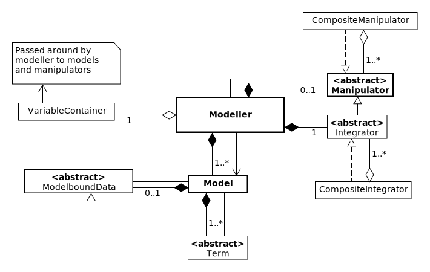

====================
Overview
====================

This page contains information condensed from the ReMKiT1D code paper. The reader is referred to that text for more details. 

-------------------------------
ReMKiT1D target problem classes
-------------------------------

ReMKiT1D is a framework for the construction of 1D models for the simulation of the tokamak Scrape-Off Layer. The goal of the framework is to enable the solution of various 1D ODEs and PDEs relevant to Scrape-Off Layer applications. These include systems of ODEs arising from Collisional-Radiative models

.. math:: 

    \frac{d\vec{v}}{dt} = \mathbf{M}(\vec{v})\cdot\vec{v} + \vec{\Gamma},

multi-fluid systems of hyperbolic conservation laws

.. math::

    \frac{\partial X\left(\vec{x}\right)}{\partial t} +\nabla\cdot\vec{\Gamma}_X\left(\vec{x}\right) = S_X,

equations without explicit time derivatives, such as Poisson's equation (an elliptic equation)

.. math::

    \Delta \varphi = f,

and finally PDEs arising from a Legendre harmonic decomposition of the electron kinetic equation 

.. math:: 

    \frac{\partial f}{\partial t} + v_x\frac{\partial f}{\partial x} + \frac{E}{m_e}\frac{\partial f}{\partial v_x} = \left(\frac{\delta f}{\delta t}\right)_{c}

-------------------------------
ReMKiT1D high level structure
-------------------------------

At a high level, ReMKiT1D uses the Modeller-Model-Manipulator pattern (described in more detail in the code paper), shown in the simplified UML diagram below

In short, one can think of a Model containing sets of Terms, corresponding to RHS terms in the equations above, as well as associated model-bound data. Those Term objects can then be evaluated or updated from the level of the Modeller, which can contain any number of Models. Finally, the Modeller has a strategy pattern relationship with various Manipulators, such as the Integrator, responsible for integrating equations represented by the Models and Terms in the Modeller. Variable data are kept in a VariableContainer object in the Modeller, and are passed to any other component that requires them.

These components work together at a high level to provide a flexible and easily extensible interface which can be accessed through the construction of JSON files using the the RMK_support package.

